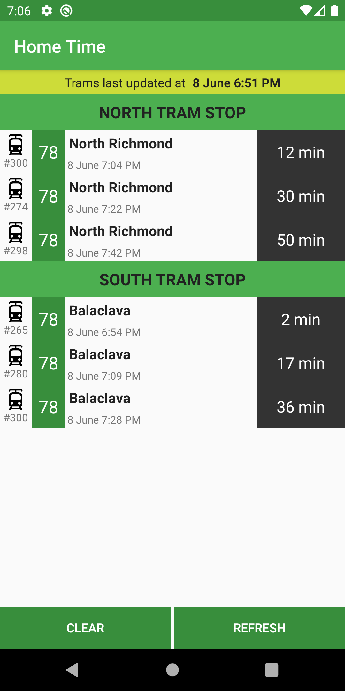
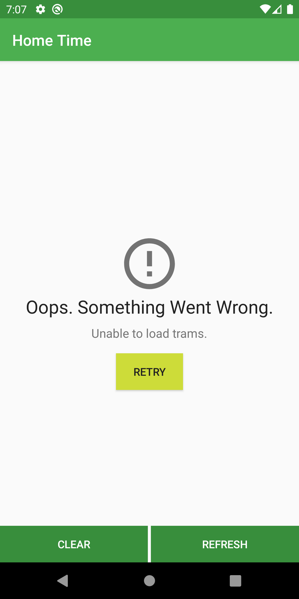
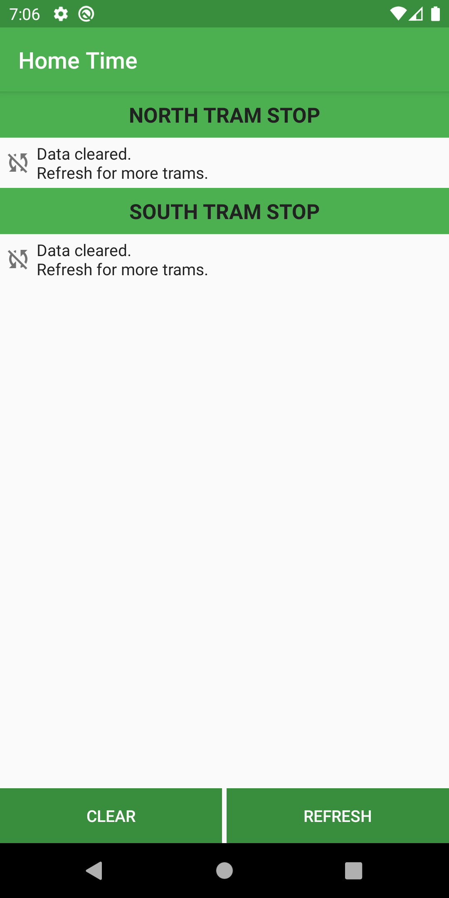
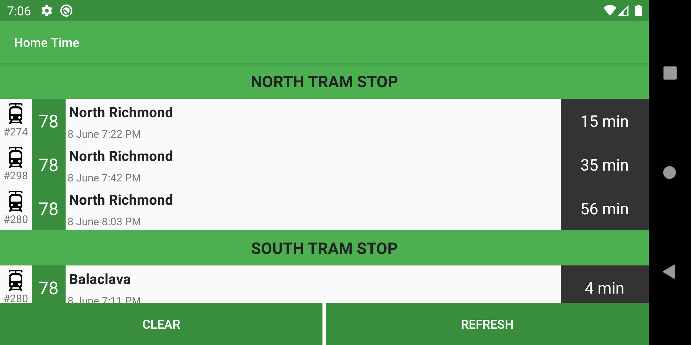

# Home Time Android

## Background
* As part of the REA 6.0 Grad Program, I was able to do the Android Bootcamp in November 2019, and was subsequently inspired to do a Mobile Rotation (Ignite App Feb 2020 - May 2020). Doing the HomeTime App as one of my commitments, and now having 4 months of solid app rotation under my belt, I'm giving it a crack.
* Some of the patterns used are things I've learnt from my rotation / bootcamp
* While some of the others are things that I've been reading about and am keen to try out in a side project (ListAdapter, DiffCallback, Coroutines)

## Thought processes about problems with the existing app architecture
* Too much logic & state stored in the activity  - no separation of concerns
* On first load, no data is served until the refresh button is clicked
* No lifecycle handling (e.g. on saveInstanceState) - state is lost when device rotates
* ApiClient repeatedly created on refreshClick. This is an expensive operation
* New token requested each time, creating unnecessary network request
* Errors not handled gracefully - only handing of error is to print stack trace & end user has no feedback as to if anything went wrong
* AsyncTask used with `.get()` instead of `onPostExecute` , this causes blocking on the UI thread
* 2 blocking network requests made back to back
* No null safety. If either of the tramList returns null, showTrams is unable to iterate through the trams and throws an error.
* Using appcompat-v7 (Version 28 is the last of legacy support library)
* Date parsing is reliant on exact positions within the string

## Thoughts about how to solve the problems with existing architecture
* Introduce ViewModel + MVVM pattern
* Create a single API Client using singleton pattern
* Cache the network token (probably use saved preferences)
* Handle the errors gracefully, with feedback to the user for the following states:
	* Loading
	* Error
	* No trams
* Async handling options to consider
	* Update AsyncTask to onPostExecute (but google docs says AsyncTask was deprecated on API level R)
	* Use retrofit's default callback with .enqueue
	* Utilise coroutines (I'll use this, as I'm keen to experiment with this)
* Load data into a live data on ViewModel initialisation, activity can subscribe & update UI on first load
* Other improvements
	* Convert project to Kotlin (null safety)
	* Improvements to UI
* Upgrade gradle wrapper build tools and migrate to androidx
* Utilise regex capture groups for date parsing

## Some considerations
### 1. How should we handle errors?
* To load the data for each activity we need to make at least 2 network calls. 1 for north trams, 1 for south trams, and 1 for the token if it was not already cached. 
* There was a consideration that needed to be made regarding the handling if only 1 request failed (e.g. north API fails, but not south), should display an Activity with partial data (e.g. South Trams only) with an error for North, or do we fail the whole page?
* Additionally, apart from displaying the error to the user, it would be good to consider if additional behaviour with errors, such as logging is required
* Ideally such requirements are clarified with the team
* For the purposes of this app, we will follow the behaviour of the existing app (1 fails, all fails)
* Errors will be displayed to user, but no additional handling (e.g. logging), nor differentiation between errors (e.g. network connectivity v.s. server error) will be implemented

### 2. The response may have a `hasError` field, which we are ignoring
According to the instructions:
```
You'll notice it's one of those APIs that sometimes gives you error messages inside a valid JSON response. We ignore this for now and assume that a `200` response means that the data will be on the `responseObject` field.
```
Hence I will ignore the hasError field & assume that I always get a successful resposne

### 3. In theory, the token may be invalidated
We cache the token to reduce network requests. Following the instuctions to assume all `200` as success, we will also be ignoring messages such as this:
```
"errorMessage": "No or invalid device token provided.",
  "hasError": true,
```
Rightfully, if we inspected the error messages, we should include handling of clearing & updating the token. However, as per the instructions this particular path will be ignored & this will be treated as a known flaw (as specified by the requirements).

### 4. What about dependency injection?
* Ideally, the ViewModel should not have to know about the activity's context
* However, we often run into the case of needing the context to retrieve string resources, as well as sharedPreferences
* To work around this I have exposed the application context in a companion object.
* If exposing the application context alone, no longer suits our needs, there are DI frameworks (e.g. Dagger, Koin) that could be used instead

### 5. Working with time
* To provide helpful information as suggested by the brief `show how far away that is from the current time (eg. 9:23 am (3 min))`, requires calculation of time difference between the user's current system time and the time presented by the server
* Time calculation on the user's device is prone to error
* E.g. if the time is set wrongly, the calculated time away will be wrong
* Additionally, performing the calculation on the user device may result in non valid time ranges (e.g negative). In this case, I have aritrarily handled with (N/A)
* Ideally the time for the next tram should be a server side calculation with filtering out of invalid ranges, to prevent these sorts of errors.
* In the absence of a server side data, I have arbitrarily calculated this on the user's device
* As per the original implementation, it is also assumed that the timezone used by the user is same as the time in the server (+1000)
* The time till the next tram `X mins`, is relative to the time data is requested at. While time keeps progressing, this time will keep reducing.
* One could contemplate how to contiuously refresh this ever changing data (Perhaps 1 min refresh intervals?)
* To keep the implementation simple (and not have continuous refreshes), I have included a header to indicate when the data was last fetched.


## Architectural / Design Choices
### MVVM pattern
* Adopt Android's recommended architecture

* Driving UI from model allows separation of concerns, allowing easier testability
* Using ViewModel allows data to persist, independent of activity life cycle, until activity is destroyed, saving the hassle of implemeting `onSaveInstanceState` in the Activity

### ListAdapter + DiffCallback
* Used this as a chance to experiment with ListAdapter 
* The [DiffUtil](https://developer.android.com/reference/androidx/recyclerview/widget/DiffUtil) provides a nice algorithm to calculate the minimal number of updates to convert one list into another
* When the ListAdapter is passed the DiffUtil callback, we are able to get nice animations & efficient updates to the recyclerView for free (rather than re-rendering the entire list via notifyDataSetChanged)

### Coroutines
* Used this as a chance to experiment with corotuines
* Using coroutines allows us to easily asynchronously call multiple network requests (e.g. north & south trams), and fail immediately to the if any of the network requests fail 
* Using coroutines also allows cancellation of the network calls if the ViewModel is destroyed, via job cancellation in the onCleared ViewModel lifecycle
* With the new coroutine pattern, I'm still trying to discover what is the best architectural pattern & how to write unite tests for the repo & ViewModel. Stay tuned!

## App previews



